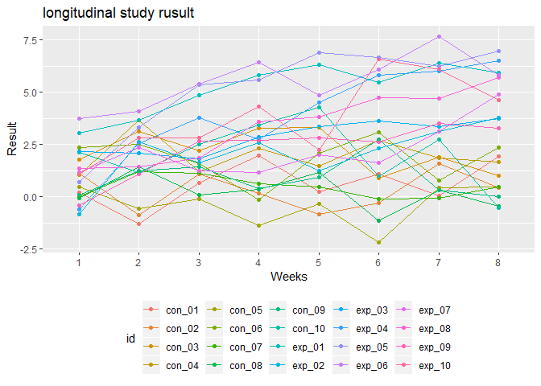
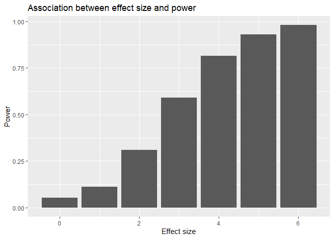
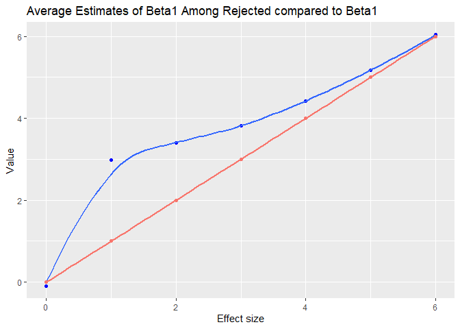

p8105\_hw5\_nl2655
================
Nankun
2019/11/11

# Raw iris data

``` r
iris_with_missing = iris %>% 
  map_df(~replace(.x, sample(1:150, 20), NA)) %>%
  mutate(Species = as.character(Species))
```

# Replacing missing

``` r
no_missing = function(x) {
  
  if (is.numeric(x)) {
    x = replace(x, is.na(x), round(mean(x, na.rm=TRUE), digits = 1))
  }
  else if (!is.numeric(x)) {
    x = replace(x, is.na(x), "virginica")
  } 
  
}
iris_no_na =
map(iris_with_missing, no_missing) %>% 
as.data.frame()
iris_no_na
```

    ##     Sepal.Length Sepal.Width Petal.Length Petal.Width    Species
    ## 1            5.1         3.5          1.4         0.2     setosa
    ## 2            4.9         3.0          1.4         0.2     setosa
    ## 3            4.7         3.2          1.3         0.2     setosa
    ## 4            4.6         3.1          1.5         1.2     setosa
    ## 5            5.0         3.6          1.4         0.2     setosa
    ## 6            5.4         3.9          1.7         0.4     setosa
    ## 7            5.8         3.4          1.4         0.3     setosa
    ## 8            5.0         3.4          1.5         0.2     setosa
    ## 9            4.4         2.9          1.4         0.2     setosa
    ## 10           4.9         3.1          3.8         0.1     setosa
    ## 11           5.4         3.1          1.5         0.2     setosa
    ## 12           4.8         3.4          1.6         0.2     setosa
    ## 13           5.8         3.1          1.4         0.1     setosa
    ## 14           4.3         3.0          3.8         0.1     setosa
    ## 15           5.8         4.0          3.8         0.2     setosa
    ## 16           5.7         4.4          1.5         0.4     setosa
    ## 17           5.4         3.9          1.3         0.4     setosa
    ## 18           5.1         3.5          1.4         1.2     setosa
    ## 19           5.7         3.8          1.7         0.3     setosa
    ## 20           5.1         3.8          1.5         1.2     setosa
    ## 21           5.4         3.4          1.7         0.2     setosa
    ## 22           5.1         3.7          1.5         0.4  virginica
    ## 23           4.6         3.6          1.0         0.2     setosa
    ## 24           5.8         3.3          3.8         0.5     setosa
    ## 25           4.8         3.4          1.9         0.2  virginica
    ## 26           5.0         3.0          3.8         0.2     setosa
    ## 27           5.0         3.4          1.6         0.4  virginica
    ## 28           5.2         3.5          1.5         0.2     setosa
    ## 29           5.8         3.4          1.4         0.2     setosa
    ## 30           4.7         3.2          1.6         0.2     setosa
    ## 31           4.8         3.1          3.8         0.2     setosa
    ## 32           5.4         3.1          1.5         0.4     setosa
    ## 33           5.2         3.1          1.5         0.1     setosa
    ## 34           5.5         4.2          1.4         0.2     setosa
    ## 35           4.9         3.1          3.8         0.2     setosa
    ## 36           5.0         3.2          1.2         0.2     setosa
    ## 37           5.5         3.5          1.3         0.2     setosa
    ## 38           4.9         3.6          1.4         0.1     setosa
    ## 39           4.4         3.0          1.3         1.2     setosa
    ## 40           5.1         3.4          1.5         0.2     setosa
    ## 41           5.0         3.5          1.3         0.3     setosa
    ## 42           4.5         3.1          1.3         1.2  virginica
    ## 43           4.4         3.2          1.3         0.2     setosa
    ## 44           5.0         3.5          1.6         0.6     setosa
    ## 45           5.1         3.8          1.9         0.4     setosa
    ## 46           4.8         3.0          1.4         0.3  virginica
    ## 47           5.1         3.8          1.6         0.2     setosa
    ## 48           4.6         3.2          3.8         0.2     setosa
    ## 49           5.3         3.7          1.5         0.2     setosa
    ## 50           5.0         3.1          1.4         0.2     setosa
    ## 51           7.0         3.1          4.7         1.4  virginica
    ## 52           6.4         3.2          4.5         1.5 versicolor
    ## 53           6.9         3.1          4.9         1.5 versicolor
    ## 54           5.5         2.3          4.0         1.3 versicolor
    ## 55           6.5         2.8          4.6         1.5 versicolor
    ## 56           5.7         2.8          4.5         1.3 versicolor
    ## 57           6.3         3.3          4.7         1.6  virginica
    ## 58           4.9         2.4          3.8         1.0 versicolor
    ## 59           6.6         2.9          4.6         1.3  virginica
    ## 60           5.2         2.7          3.9         1.4 versicolor
    ## 61           5.0         2.0          3.8         1.0 versicolor
    ## 62           5.9         3.0          4.2         1.5 versicolor
    ## 63           6.0         2.2          4.0         1.2 versicolor
    ## 64           6.1         2.9          4.7         1.4 versicolor
    ## 65           5.6         2.9          3.6         1.3 versicolor
    ## 66           6.7         3.1          4.4         1.4 versicolor
    ## 67           5.6         3.0          4.5         1.5 versicolor
    ## 68           5.8         3.1          4.1         1.0 versicolor
    ## 69           6.2         2.2          4.5         1.5 versicolor
    ## 70           5.6         2.5          3.9         1.1 versicolor
    ## 71           5.9         3.2          4.8         1.8 versicolor
    ## 72           5.8         2.8          4.0         1.3  virginica
    ## 73           6.3         2.5          4.9         1.5 versicolor
    ## 74           5.8         2.8          3.8         1.2 versicolor
    ## 75           6.4         2.9          4.3         1.3 versicolor
    ## 76           6.6         3.0          4.4         1.4 versicolor
    ## 77           6.8         2.8          4.8         1.4 versicolor
    ## 78           6.7         3.1          5.0         1.2 versicolor
    ## 79           6.0         3.1          4.5         1.2 versicolor
    ## 80           5.7         2.6          3.5         1.0  virginica
    ## 81           5.5         2.4          3.8         1.1 versicolor
    ## 82           5.8         2.4          3.7         1.0 versicolor
    ## 83           5.8         2.7          3.9         1.2 versicolor
    ## 84           6.0         2.7          5.1         1.6 versicolor
    ## 85           5.4         3.0          4.5         1.5 versicolor
    ## 86           5.8         3.4          4.5         1.6 versicolor
    ## 87           6.7         3.1          4.7         1.2 versicolor
    ## 88           5.8         3.1          4.4         1.3 versicolor
    ## 89           5.6         3.0          3.8         1.2 versicolor
    ## 90           5.5         2.5          4.0         1.2 versicolor
    ## 91           5.5         3.1          4.4         1.2 versicolor
    ## 92           5.8         3.1          4.6         1.2 versicolor
    ## 93           5.8         3.1          4.0         1.2 versicolor
    ## 94           5.0         2.3          3.3         1.2  virginica
    ## 95           5.8         2.7          4.2         1.3 versicolor
    ## 96           5.7         3.0          4.2         1.2 versicolor
    ## 97           5.7         2.9          4.2         1.3 versicolor
    ## 98           6.2         2.9          4.3         1.3 versicolor
    ## 99           5.1         2.5          3.0         1.2 versicolor
    ## 100          5.7         2.8          4.1         1.3  virginica
    ## 101          6.3         3.1          3.8         2.5  virginica
    ## 102          5.8         2.7          5.1         1.9  virginica
    ## 103          7.1         3.0          5.9         2.1  virginica
    ## 104          6.3         2.9          5.6         1.8  virginica
    ## 105          6.5         3.1          5.8         2.2  virginica
    ## 106          7.6         3.0          6.6         2.1  virginica
    ## 107          4.9         2.5          4.5         1.7  virginica
    ## 108          7.3         2.9          6.3         1.8  virginica
    ## 109          6.7         3.1          3.8         1.8  virginica
    ## 110          5.8         3.6          3.8         2.5  virginica
    ## 111          6.5         3.2          5.1         2.0  virginica
    ## 112          5.8         2.7          5.3         1.9  virginica
    ## 113          6.8         3.0          5.5         2.1  virginica
    ## 114          5.7         3.1          5.0         2.0  virginica
    ## 115          5.8         2.8          5.1         2.4  virginica
    ## 116          6.4         3.2          5.3         2.3  virginica
    ## 117          6.5         3.0          3.8         1.8  virginica
    ## 118          7.7         3.8          6.7         1.2  virginica
    ## 119          7.7         2.6          6.9         2.3  virginica
    ## 120          6.0         2.2          5.0         1.5  virginica
    ## 121          5.8         3.2          5.7         1.2  virginica
    ## 122          5.6         3.1          4.9         2.0  virginica
    ## 123          7.7         2.8          6.7         2.0  virginica
    ## 124          6.3         2.7          4.9         1.8  virginica
    ## 125          6.7         3.3          5.7         2.1  virginica
    ## 126          7.2         3.2          6.0         1.8  virginica
    ## 127          6.2         2.8          4.8         1.8  virginica
    ## 128          6.1         3.0          4.9         1.8  virginica
    ## 129          6.4         2.8          5.6         2.1  virginica
    ## 130          7.2         3.0          5.8         1.6  virginica
    ## 131          7.4         2.8          6.1         1.2  virginica
    ## 132          7.9         3.8          3.8         2.0  virginica
    ## 133          6.4         2.8          3.8         2.2  virginica
    ## 134          5.8         2.8          5.1         1.5  virginica
    ## 135          6.1         3.1          5.6         1.4  virginica
    ## 136          5.8         3.0          6.1         2.3  virginica
    ## 137          5.8         3.4          5.6         1.2  virginica
    ## 138          6.4         3.1          5.5         1.2  virginica
    ## 139          6.0         3.0          4.8         1.8  virginica
    ## 140          6.9         3.1          5.4         2.1  virginica
    ## 141          6.7         3.1          5.6         2.4  virginica
    ## 142          6.9         3.1          5.1         2.3  virginica
    ## 143          5.8         2.7          5.1         1.9  virginica
    ## 144          6.8         3.2          3.8         2.3  virginica
    ## 145          6.7         3.3          3.8         2.5  virginica
    ## 146          6.7         3.0          5.2         2.3  virginica
    ## 147          6.3         2.5          5.0         1.9  virginica
    ## 148          6.5         3.0          5.2         2.0  virginica
    ## 149          5.8         3.4          5.4         2.3  virginica
    ## 150          5.9         3.0          5.1         1.8  virginica

# plot on longitudinal study

``` r
read_csv = function(x) {
   read.csv(x)
}
z_df =
  tibble(list.files("./z")) %>% 
  rename(id = `list.files("./z")`) %>% 
  mutate(
    root = "./z/", 
    path = str_c(root, id) ,
    data = map(path, read_csv)
    ) %>% 
   mutate(
     id = str_replace(id, ".csv", ""),
     ) %>% 
  select(id, data) %>% 
  unnest() %>% 
   pivot_longer(
    week_1:week_8,
    names_to = "weeks",
    names_prefix = "week_",
    values_to = "result")
```

    ## Warning: `cols` is now required.
    ## Please use `cols = c(data)`

``` r
z_df %>% 
  ggplot(aes(x = weeks, y = result)) +
  geom_point(aes(group=id,color=id)) +
  geom_line(aes(group=id,color=id)) +
  labs(
    x="Weeks",
    y="Result",
    title = "longitudinal study rusult"
  )+
  theme(legend.position = "bottom")
```

<!-- -->

# simulation

## association

``` r
sim_regression = function(n = 30, beta0 = 2, beta1) {
  
  sim_data = tibble(
    x = rnorm(n),
    y = beta0 + beta1 * x + rnorm(n, 0, sqrt(50))
  )
  
  ls_fit = lm(y ~ x, data = sim_data)
  tibble(
    beta1_hat = round(coef(ls_fit)[2],digits = 4),
    p = round(broom::tidy(ls_fit)[[2,5]], digits = 4)
  )
  
}


sim_curr = 
  tibble(beta1 = c(0, 1, 2, 3, 4, 5, 6)) %>% 
  mutate(
    output_lists = map(.x = beta1, ~rerun(10000, sim_regression(beta1 = .x))),
    estimate_dfs = map(output_lists, bind_rows)) %>% 
  select(-output_lists) %>% 
  unnest(estimate_dfs) %>% 
  mutate(
    significant = case_when(
    p > 0.05 ~ "nonsign",
    p <= 0.05 ~ "sign")
  )
sim_curr %>% 
  group_by(beta1, significant) %>% 
  summarize(
    n = n()
  ) %>% 
   pivot_wider(
    names_from = significant,
    values_from = n
 ) %>% 
  mutate(
    power = round(sign / (sign + nonsign), digits=4)
  ) %>% 
  ggplot(aes(x = beta1, y = power)) +
  geom_histogram(stat = "identity") +
  labs(
    x="Effect size",
    y="Power",
    title = "Association between effect size and power"
  )
```

    ## Warning: Ignoring unknown parameters: binwidth, bins, pad

<!-- -->

From the plot we can see that on average, the larger the effect size is
the larger the power will be.

## beta1 and hat

``` r
sim_curr %>% 
  filter(significant == "sign") %>% 
  group_by(beta1) %>% 
  summarize(
    ave = mean(beta1_hat)
  ) %>% 
  ggplot(aes(x = beta1, y = ave)) + 
  geom_point(color = "blue") +
  geom_smooth(se = FALSE) +
  geom_point(aes(x = beta1, y = beta1, color = "pink")) +
  geom_smooth(aes(x = beta1, y = beta1, color = "pink")) +
   labs(
    x="Effect size",
    y="Value",
    title="Average Estimates of Beta1 Among Rejected compared to Beta1"
   ) +
  theme(legend.position = "hide")
```

    ## `geom_smooth()` using method = 'loess' and formula 'y ~ x'
    ## `geom_smooth()` using method = 'loess' and formula 'y ~ x'

<!-- -->

The blue line is the average estimate beta1 hat by Effect size.

the orange line is the true value beta1 by Effect size.

From the plot, we can see that the average estimate beta1 always larger
than the true value beta1(e.g. when beta1 = 1, two lines are obverisly
different). Therefore, average of beta1 across tests for which the null
is rejected is not equal to the true value of beta1.
